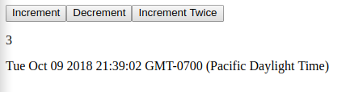

# Client-side Web Development in pure rust

When you need rapid, sane graphical application development, your options are basically non-existent.
Most people end up reaching for web technologies, even if that's not the right tool for the job, as I did when I needed to bang something out in a weekend.
But now, the application was about to grow past 500 lines of Javascript, which is more than I'm willing to tolerate that language.
Since my use case needs to be highly cross platform, and I like what `<canvas>` lets me do, I decided to take a more serious look at the Rust ecosystem for web app development.

What you may initially stumble upon is `wasm-bindgen`. Looking at the [guide](https://rustwasm.github.io/wasm-bindgen/introduction.html), it looks like we'll have to write our own
js harness for most things. `web-sys` looks like it can save us some work, but the idea of replacing imperative, global javascript code with Rust calling into global, imperative javascript code didn't sound like a good idea to me. Luckily, the Rust ecosystem comes to the resque with an elegant trifecta of web application development:

1. `yew` handles all the messy UI code in an elegant and potentially multithreaded way.
2. `cargo web` lets us deploy our application extremely easily. There's no javascript harnesses, no messing around with compiler backends, and no worries about passing memory between javascript and Rust.
3. `stdweb` and it's `js!` abstracts what `wasm-bindgen` would have done. It packages a rusty interface to Web API functionality, and allows us to write javascript code inline with Rust code when we need to.

Let's see how they fit together.

```sh
mkdir rust-web
cd rust-web
cargo init client
cargo install --force cargo-web
```

First, `yew` has undergone some major breaking changes since its last release, so we're going to use the version from git.

```toml
# Cargo.toml
[package]
name = "client"
version = "0.1.0"
authors = ["..."]

[dependencies]
stdweb = "0.4.9"
yew = {git = "https://github.com/DenisKolodin/yew"}
```

Now, let's pick an example from the yew repository and give it a whirl. I'm going to choose the quintessential "Hello World", the [counter](https://github.com/DenisKolodin/yew/tree/master/examples/counter).

Add `lib.rs` and `main.rs` to `src`:

```rust
// src/lib.rs
extern crate stdweb;
#[macro_use]
extern crate yew;

use stdweb::web::Date;
use yew::prelude::*;
use yew::services::ConsoleService;

pub struct Model {
    console: ConsoleService,
    value: i64,
}

pub enum Msg {
    Increment,
    Decrement,
    Bulk(Vec<Msg>),
}

impl Component for Model {
    type Message = Msg;
    type Properties = ();

    fn create(_: Self::Properties, _: ComponentLink<Self>) -> Self {
        Model {
            console: ConsoleService::new(),
            value: 0,
        }
    }

    fn update(&mut self, msg: Self::Message) -> ShouldRender {
        match msg {
            Msg::Increment => {
                self.value = self.value + 1;
                self.console.log("plus one");
            }
            Msg::Decrement => {
                self.value = self.value - 1;
                self.console.log("minus one");
            }
            Msg::Bulk(list) => for msg in list {
                self.update(msg);
                self.console.log("Bulk action");
            },
        }
        true
    }
}

impl Renderable<Model> for Model {
    fn view(&self) -> Html<Self> {
        html! {
            <div>
                <nav class="menu",>
                    <button onclick=|_| Msg::Increment,>{ "Increment" }</button>
                    <button onclick=|_| Msg::Decrement,>{ "Decrement" }</button>
                    <button onclick=|_| Msg::Bulk(vec![Msg::Increment, Msg::Increment]),>{ "Increment Twice" }</button>
                </nav>
                <p>{ self.value }</p>
                <p>{ Date::new().to_string() }</p>
            </div>
        }
    }
}

// src/main.rs
extern crate client;
extern crate yew;

use client::Model;
use yew::prelude::*;

fn main() {
    yew::initialize();
    App::<Model>::new().mount_to_body();
    yew::run_loop();
}
```

Now we're ready to test! Just run `cargo web build`, and you may or may not get a huge error!

```sh
cargo web build
   Compiling client v0.1.0 (file:///home/josh/projects/rust-web/client)
    Finished dev [unoptimized + debuginfo] target(s) in 0.78s
   Compiling client v0.1.0 (file:///home/josh/projects/rust-web/client)
error: linking with `emcc` failed: exit code: 1
  |
  = note: "emcc" "-s" "DISABLE_EXCEPTION_CATCHING=0" "-L" "/home/josh/.rustup/toolchains/nightly-x86_64-unknown-linux-gnu/lib/rustlib/asmjs-unknown-emscripten/lib" "/home/josh/projects/rust-web/client/target/asmjs-unknown-emscripten/debug/deps/client-e98ea458a06a6ea8.1gfu5kd8fr3r9j2y.rcgu.o"
  ...
  "/home/josh/.rustup/toolchains/nightly-x86_64-unknown-linux-gnu/lib/rustlib/asmjs-unknown-emscripten/lib/libcompiler_builtins-9836d3a278b82c3e.rlib" "-l" "c" "-s" "NO_EXIT_RUNTIME=1" "-s" "ALLOW_MEMORY_GROWTH=0" "-s" "ERROR_ON_UNDEFINED_SYMBOLS=1" "-s" "ABORTING_MALLOC=0" "-s" "WASM=0"
  = note: INFO:root:Checking JS engine ['node'] failed. Check your config file. Details: [Errno 2] No such file or directory
          WARNING:root:cannot check node version: [Errno 2] No such file or directory
          INFO:root:(Emscripten: Running sanity checks)
          CRITICAL:root:The JavaScript shell used for compiling (['node']) does not seem to work, check the paths in ~/.emscripten

error: aborting due to previous error
error: Could not compile `client`.

To learn more, run the command again with --verbose.
```

Thankfully, we get a very helpful error message, telling us node isn't installed. This is because `cargo web` defaults to an asm.js backend that relies on node.
Since we're all cutting edge here, we want to use llvm's WebAssembly backend. This can be done with `cargo web build --target=wasm32-unknown-unknown` (requires rust nightly).
To avoid having to type this all the time, `cargo web` conveniently supports a `Web.toml` file, placed adjacent to `Cargo.toml`.

```toml
default-target = "wasm32-unknown-unknown"

[cargo-web]
minimum-version = "0.6.16"
```

A few other options are supported. Check out the [README on GitHub](https://github.com/koute/cargo-web) for details.

## The First Run

We haven't touched any HTML, CSS, or JS and we're ready to run our *Web*App.

```sh
cargo web start
warning: debug builds on the wasm32-unknown-unknown are currently totally broken
         forcing a release build
    Finished release [optimized] target(s) in 0.03s
    Garbage collecting "client.wasm"...
    Processing "client.wasm"...
    Finished processing of "client.wasm"!

If you need to serve any extra files put them in the 'static' directory
in the root of your crate; they will be served alongside your application.
You can also put a 'static' directory in your 'src' directory.

Your application is being served at '/client.js'. It will be automatically
rebuilt if you make any changes in your code.

You can access the web server at `http://127.0.0.1:8000`.
```



Beautiful.

## How it all works

"Ok," I hear you say, "but can I add CSS?". Yes you can! Let's understand some of the magic here so we can do some more stuff.
Look inside `target/wasm32-unknown-unknown/release` and you'll find a `client.js` and a `client.wasm`.
Unsurprisingly, `client.js` loads `client.wasm` and handles all of `stdweb`'s functionality. It also sets up shared memory between javascript and WebAssembly. Looking inside, it's not something you'd want to write yourself. I was going to dissassemble `client.wasm` like the `wasm-bindgen [guide](https://rustwasm.github.io/wasm-bindgen/examples/add.html), but the binary is 243kb and 83,000 lines dissassembled and pretty printed. I'll rest easy just knowing that it works.

The point is, all we need to do is give `yew` a `<body>` element, and `cargo web` copies everything in the `static` folder.

```html
<!-- static/index.html -->
<!doctype html>
<html lang="en">
    <head>
        <meta charset="utf-8">
        <title>Test file</title>
        <!-- CSS or analytics or whatever -->
        <script src="client.js"></script>
    </head>
    <body>
    </body>
</html>
```

Give it another `cargo web start`, and see that the title shows up properly. Yay.
(If you want to package a little bit of javascript into `client.js`, the `Web.toml` `prepend-js` key has you covered. Check the [README](https://github.com/koute/cargo-web) for details.)

## Deploying

This one's super short.

```sh
cargo web deploy
warning: debug builds on the wasm32-unknown-unknown are currently totally broken
         forcing a release build
    Finished release [optimized] target(s) in 0.03s
    Garbage collecting "client.wasm"...
    Processing "client.wasm"...
    Finished processing of "client.wasm"!
The `client` was deployed to "/home/josh/projects/rust-web/client/target/deploy"!
```

This collects all the files in static, combines them with `client.js` and `client.wasm`, and then places them in `target/deploy` for easy copying. In most cases, you'd want to copy this to a server, but my app just runs in a browser for internal use, so this is all I need.
